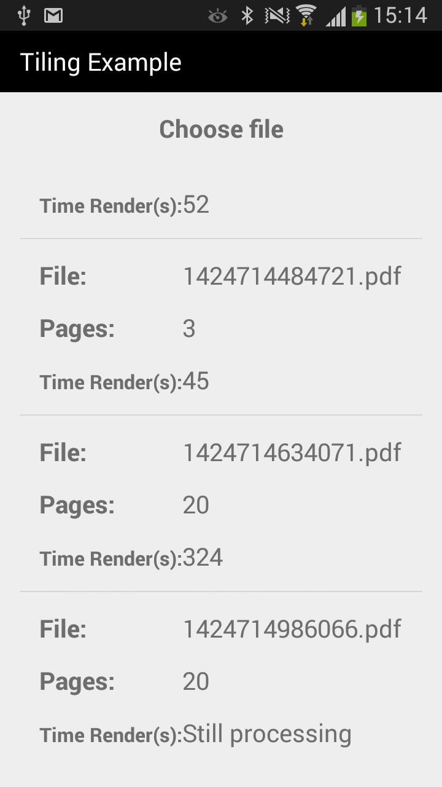
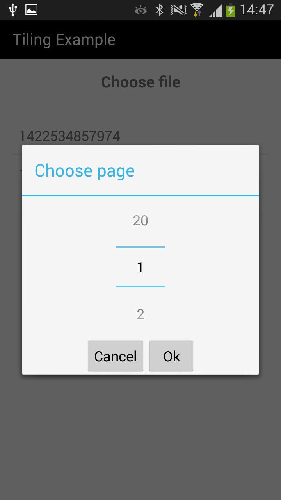
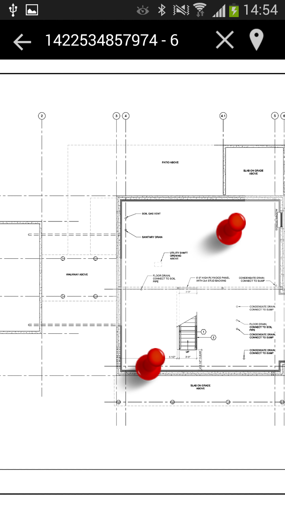

# Android Simple Tiling Example

This app uses [TileView](https://github.com/moagrius/TileView)
to show pictures that are cropped into tiles from [node-pdf-tiling](https://github.com/ericmaciel/node-pdf-tiling) app.

Its using [Picasso](http://square.github.io/picasso/) to download tiles but you can change to use default HttpURLConnection by commenting first part and uncomment second part in TileFragment.java file.
```java
    //Using Picasso
    mTileView.setDecoder(new PicassoBitmapDecoder(mPdf, mPage));
    mTileView.addDetailLevel(0.125f, "12.5:%col%:%row%");
    mTileView.addDetailLevel(0.250f, "25:%col%:%row%");
    mTileView.addDetailLevel(0.500f, "50:%col%:%row%");
    mTileView.addDetailLevel(1.000f, "100:%col%:%row%");
    mTileView.setScale(0.125f);

    //Using HttpURLConnection
    /*mTileView.setDecoder(new BitmapDecoderHttp());
    String endpoint = App.END_POINT + "/files/";
    mTileView.addDetailLevel(0.125f, endpoint + mPdf + "/" + mPage + "?zoom=12.5&col=%col%&row=%row%");
    mTileView.addDetailLevel(0.250f, endpoint + mPdf + "/" + mPage + "?zoom=25&col=%col%&row=%row%");
    mTileView.addDetailLevel(0.500f, endpoint + mPdf + "/" + mPage + "?zoom=50&col=%col%&row=%row%");
    mTileView.addDetailLevel(1.000f, endpoint + mPdf + "/" + mPage + "?zoom=100&col=%col%&row=%row%");
    */
```

Also make sure the app is pointing to the proper [node-pdf-tiling](https://github.com/ericmaciel/node-pdf-tiling) server in App.java file
```java
public static final String END_POINT = "SERVER_LOCATION_HERE";
```

You can add/remove pins into the picture, also drag and drop them

### Screens




### Using
[Retrofit](http://square.github.io/retrofit/)
[JavaRx](https://github.com/ReactiveX/RxJava)
[RxAndroid](https://github.com/ReactiveX/RxAndroid)
[TileView](https://github.com/moagrius/TileView)
[Picasso](http://square.github.io/picasso/)